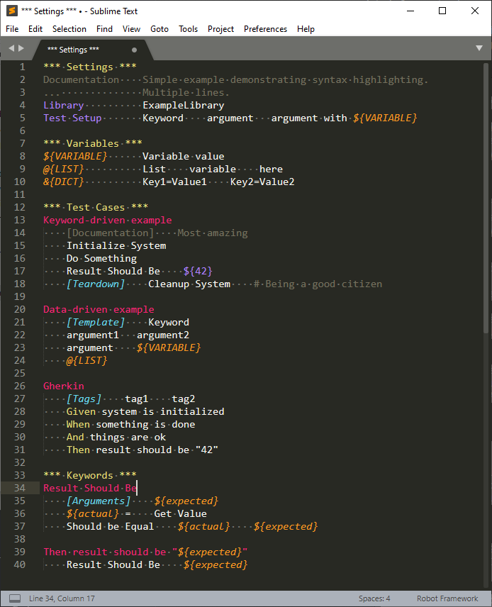

# Robot Framework syntax for Sublime Text

What's included:

 * Syntax highlighting for Robot Framework
 * Build system for Robot Framework
 * Command to execute [`robot.tidy`](https://robotframework.org/robotframework/latest/RobotFrameworkUserGuide.html#test-data-clean-up-tool-tidy) for current buffer

What's not, and will be not, included:

 * IDE-like features

To get IDE-like features for RF

 1. Install this plugin
 2. Install https://packagecontrol.io/packages/LSP for Sublime Text
 3. execute `pip install robotframwork_ls`
 4. Add 

    "robotframework": {
      "command": ["python", "-m", "robotframework_ls"],
      "enabled": true,
      "languageId": "robotframework",
      "scopes": [
        "source.robot",
        "source.resource"
      ],
      "syntaxes": [
        "Packages/Robot Framework Syntax/RobotFrameworkSyntax.sublime-syntax"
      ]
    }

    to LSP settings' clients.

## How to install

Open the command palette and run Package Control: Install Package, then select Robot Framework Syntax.

## Obligatory example image

